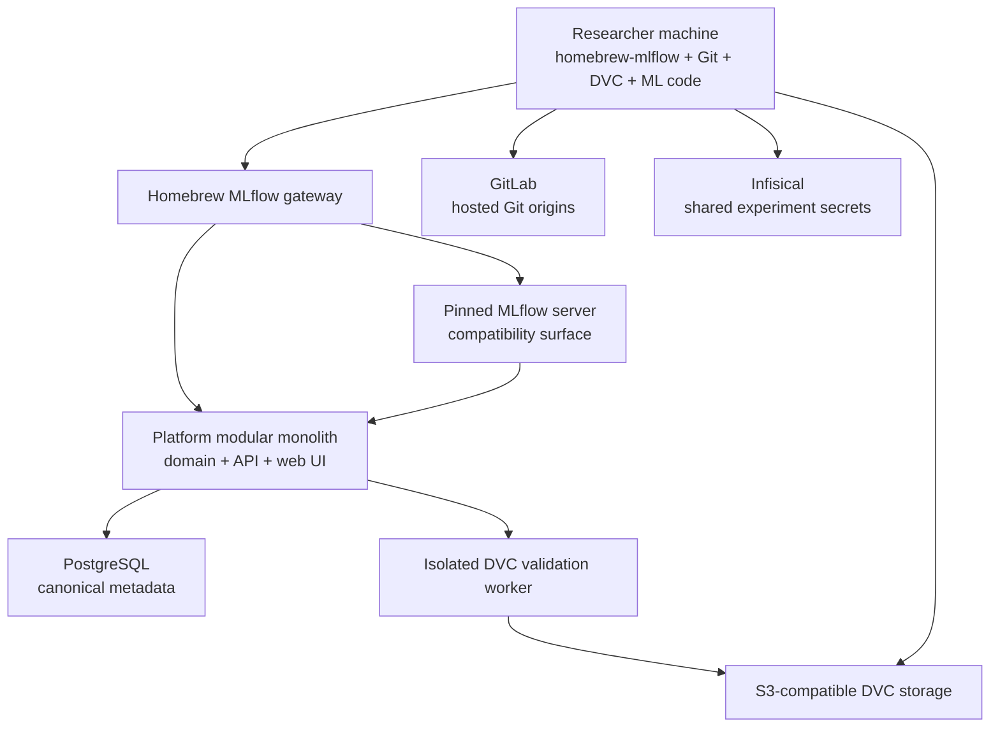

# Homebrew MLflow — Implementation Specification

Status: implementation handoff
Date: 2026-08-12
Audience: Codex or another implementation agent
Product name, service-hosted Python distribution, and executable: `homebrew-mlflow`

## 1. How to use this document

This document is the consolidated source of truth for implementing Homebrew MLflow v1. It replaces the need to read the architecture overview, domain-model notes, researcher workflow, and ADR-001 through ADR-018 separately.

Treat statements marked **MUST**, **MUST NOT**, **SHOULD**, and **MAY** as normative. Accepted architecture must not be changed merely to simplify implementation. If an accepted requirement is impossible or internally inconsistent, stop, document the conflict, and propose a new ADR before changing it.

Implementation should proceed incrementally. Each milestone must leave the repository runnable, tested, documented, and deployable. Do not attempt to implement every integration in one unverified pass.

This handoff adds a small number of **v1 implementation defaults** where earlier design work intentionally left protocol details open. They are binding for the first implementation unless a later ADR supersedes them.

## 2. Product goal

Homebrew MLflow is a self-hosted research system of record and archive for computational and ML research. It owns durable identities, experiment metadata, immutable artifact-version metadata, provenance, access control, hosted Git origins, and archival object storage.

Researchers run training, evaluation, notebooks, scripts, DVC pipelines, and agents on their own machines or other external compute. Those clients report metadata and publish validated outputs to Homebrew MLflow.

The initial deployment targets one trusted research team on one sufficiently provisioned VPS. The design must still use clear boundaries, durable state, least-privilege credentials, and off-host backup hooks.

## 3. Non-negotiable scope boundary

Homebrew MLflow is an **archival control plane with owned storage**, not a compute platform.

The platform MUST own:

- users, machine principals, organization and project membership;
- Research Projects and their metadata;
- canonical Experiments, Runs, parameters, metric histories, tags, and lifecycle state;
- hosted Git origins through GitLab;
- immutable Artifact and Artifact Version records;
- provenance among Runs, commits, pipeline versions, environments, inputs, and outputs;
- platform-managed DVC-compatible object storage;
- publication validation, integrity state, retention metadata, sharing, and archival access;
- HTTPS APIs, SSE observation, a web UI, and a cross-platform credential helper.

The platform MUST NOT:

- schedule or execute experiments;
- allocate GPUs or manage worker fleets for research workloads;
- run `dvc repro`, `dvc exp run`, training code, evaluation code, repository hooks, or user pipeline commands;
- supervise the live runtime state of researchers' machines;
- treat a locally launched subprocess as server-side execution.

The server-side DVC validation worker is not a research executor. It may only interpret committed metadata and verify already-stored objects under the restrictions in section 15.

## 4. System context and authority map



| Concern | Canonical authority |
| --- | --- |
| Organization, principals, memberships, authorization | Homebrew MLflow PostgreSQL domain model |
| Research Projects, Experiments, Runs, metrics, tags, provenance | Homebrew MLflow PostgreSQL domain model |
| Git objects and refs | GitLab |
| Artifact Version lifecycle, ownership, sharing, and provenance | Homebrew MLflow PostgreSQL domain model |
| Large content identity | Algorithm-qualified DVC output identity |
| Physical large-object bytes | Platform-managed S3-compatible storage, initially MinIO or equivalent |
| MLflow protocol behavior | Pinned upstream MLflow server and platform-backed plugins |
| Shared experiment secret values | Infisical |
| Local pipeline/cache/materialization behavior | Native DVC |

No integration product may introduce a second authoritative ACL or domain database for platform-owned concepts.

## 5. Recommended implementation shape

Use a **modular monolith** for the platform domain, plus separately deployed compatibility and worker processes. Do not split domain modules into network microservices in v1.

Recommended repository layout:

```text
homebrew-mlflow/
  apps/
    api/                    # HTTPS API and SSE
    web/                    # browser UI
    worker/                 # publication worker entry point
    mlflow_plugins/         # Tracking Store, Workspace, Artifact Repository, Run Context
  packages/
    domain/                 # entities, value objects, invariants, policies
    application/            # use cases and ports
    infrastructure/         # PostgreSQL, GitLab, S3, Infisical reconciliation
    contracts/              # OpenAPI 3.2, SSE schemas, generated clients
    cli/                    # service-hosted Python package and homebrew-mlflow executable
  repository_template/
    scripts/
      run-experiment.py
      dvc-publish.sh
      dvc-publish.ps1
  migrations/
  tests/
    unit/
    integration/
    contract/
    e2e/
  deploy/
    compose/
    reverse-proxy/
    backup/
  docs/
  pyproject.toml
  README.md
```

Recommended default technology choices:

- Python with FastAPI for the HTTP/SSE application; keep the domain and application layers framework-independent.
- SQLAlchemy and Alembic, or verified equivalents, for PostgreSQL persistence and migrations; do not expose ORM objects as API/domain models.
- Pydantic or generated contract models at the API/configuration boundaries.
- PostgreSQL for all canonical metadata, audit records, durable operations, and operation-event replay.
- A PostgreSQL-backed worker queue using transactional claiming/`SKIP LOCKED` semantics for v1; do not add Redis solely for job dispatch.
- S3-compatible object storage for DVC objects and policy-limited Run attachments.
- GitLab, Infisical, and MinIO/equivalent as external deployed products, accessed through adapters.
- A typed web client generated from the OpenAPI contract. A TypeScript SPA is recommended, but the HTTP/domain contracts do not depend on a specific UI framework.
- Containerized deployment on one VPS behind one TLS reverse proxy.

Exact dependency versions MUST be pinned in lockfiles and container digests. The implementation must record a compatibility matrix for Python, PostgreSQL, DVC, MLflow server/client, OpenAPI tooling, Swagger UI, GitLab, Infisical CLI, and object storage. Do not claim support outside the tested matrix.

## 6. Tenancy and authorization

### 6.1 Organization

- Each v1 installation contains exactly one Organization.
- Organization remains a first-class entity so future multi-organization migration is possible.
- Every Research Project belongs to the Organization.
- Every human or machine principal must belong to the Organization before receiving a project role.
- VPS/operator access is distinct from platform research authorization.

Organization roles:

| Role | Permission |
| --- | --- |
| `Admin` | Manage organization membership and project lifecycle/recovery; does not automatically read project content |
| `Member` | Belong to the organization and be invited to projects; no organization-wide research-data access |

An Organization Admin assigning themselves a project role for recovery MUST create an auditable authorization event.

### 6.2 Research Project

A Research Project is the primary collaboration, ownership, authorization, retention, and discovery aggregate. It may contain zero or more Git repositories and many Experiments, Runs, Artifacts, and Pipeline Definitions. It is not synonymous with a Git repository.

Project roles are hierarchical:

| Role | Capabilities |
| --- | --- |
| `Viewer` | Read project metadata/provenance, clone/read repositories, download versions accessible to the project |
| `Contributor` | Viewer capabilities plus push permitted Git refs, create/update Experiments and Runs, register Pipeline Versions, transfer DVC objects, and request Artifact Version publication |
| `Maintainer` | Contributor capabilities plus manage project settings/memberships, repository policy, sharing grants, retention actions, Infisical project secrets, and project archival |

Project Membership is the sole ordinary authorization source for every contained repository, Experiment, Run, Pipeline, Artifact, and Artifact Version. V1 MUST NOT implement repository-specific, artifact-specific, or general resource ACL overrides. A resource needing a different audience belongs in another Research Project.

Machine principals may hold only `Viewer` or `Contributor`. Effective machine authorization is:

```text
project role ∩ machine-credential scopes ∩ endpoint requirement
```

Machine credential scopes only narrow authority; they never expand it.

## 7. Core domain model

### 7.1 Identity and access entities

- `Organization`
- `Principal` with subtype/kind `human` or `machine`
- `ExternalIdentityBinding` containing issuer and immutable subject, initially GitLab user ID
- `OrganizationMembership`
- `ProjectMembership`
- `HumanRefreshCredential` containing only a digest, token-family metadata, rotation/reuse state, timestamps, and audit information
- `MachineCredential` containing only a secret digest, rotation state, explicit scopes, one machine principal, and one project
- `AuditEvent`

### 7.2 Research organization entities

- `ResearchProject`
- `GitRepository`
- `Experiment`
- `Run`
- `RunParameter`
- `RunTag`
- `MetricObservation`
- `RunAttachment`
- `EnvironmentSpecification`
- `PipelineDefinition`
- `PipelineVersion`
- MLflow workspace, experiment, and run mappings
- optional `SecretContext` containing safe Infisical coordinates only

### 7.3 Artifact and provenance entities

- `Artifact`: stable logical family owned by exactly one project
- `ArtifactVersion`: immutable lifecycle/provenance identity owned through its Artifact
- `DvcOutputIdentity`: algorithm, digest, kind, size, and file count for one complete declared output root
- `Blob`: digest, algorithm, size, integrity state
- `FileIndexEntry`: relative path, size, and referenced blob/object identity
- `StorageLocation`: physical placement and availability state
- `DvcPublicationRecord`: committed Git/DVC source and validation evidence
- `PublicationOperation` and `PublicationEvent`
- `ArtifactSharingGrant`
- `SharedArtifactReference`
- `ArtifactDerivation`
- typed `ProvenanceRelation`

### 7.4 Required identifiers and timestamps

- Use opaque, globally unique, time-sortable public IDs with stable prefixes such as `org_`, `pr_`, `repo_`, `exp_`, `run_`, `ar_`, `av_`, `pub_`, and `principal_`.
- Database primary keys MAY be UUIDs/ULIDs, but public APIs MUST NOT expose sequential database IDs.
- Store all timestamps as timezone-aware UTC.
- Mutable labels are for discovery only; provenance uses immutable IDs and Git commit SHAs.
- Soft deletion/archive state is required for durable domain records. Physical purge is a separate retention operation.

### 7.5 Required invariants

- Each Git Repository, Experiment, Artifact, and Pipeline Definition belongs to exactly one project.
- Each Artifact Version belongs to exactly one Artifact and is immutable after publication.
- Each Artifact Version has exactly one algorithm-qualified DVC output identity.
- One Artifact Version represents one complete declared DVC output root: a file or directory tree.
- Several Artifact Versions may have the same DVC identity without merging ownership, lifecycle, labels, sharing, or provenance.
- A completed Run never silently changes its resolved commit, pipeline version, environment, or exact input/output Artifact Version IDs.
- A retry is a new Run linked to the previous attempt.
- Mutable branches, tags, paths, `latest`, and human labels are never sufficient provenance identities.
- Removing physical bytes changes availability; it does not rewrite history.
- An Artifact Version cannot be purged while retained Runs, references, derivatives, or other provenance require it.

## 8. Cross-project sharing and derivation

Artifacts remain owned by one project. Cross-project reuse is explicit and project-to-project.

An `ArtifactSharingGrant` MUST identify exactly:

- the owning project, derived from the target Artifact Version;
- one exact immutable Artifact Version;
- one consuming project;
- creation/effective/revocation timestamps and actor.

A grant for one version grants no access to earlier, later, or future versions. Each additional version requires a new grant.

Read-only reuse creates a `SharedArtifactReference`; it does not transfer ownership, create another logical version, or require another physical copy.

If the consuming project modifies shared content, create a new Artifact family owned by the consuming project, create its first Artifact Version, and record `derived_from` to the exact source Artifact Version. Never append versions to an Artifact owned by another project.

Revocation is prospective:

- block new Shared Artifact References;
- block new Runs using the version;
- block ordinary new platform-served byte access;
- retain audit/identity metadata;
- preserve exact provenance visibility and archival byte access for Runs completed before revocation;
- preserve independently owned derivatives created before revocation;
- do not claim to revoke bytes already downloaded externally.

V1 implementation default: active or planned Runs receive no grace period. They must have reached a completed terminal state before the revocation effective time to receive the reproducibility exception.

## 9. GitLab integration

- One Research Project maps to one GitLab group/namespace.
- Each platform Git Repository maps to one GitLab project/repository in that group.
- GitLab is authoritative for Git objects and refs only.
- Human Git access uses GitLab SSH by default.
- Git credentials MUST NOT authenticate platform APIs, MLflow, DVC storage, or Infisical.
- Platform membership changes must be reconciled to GitLab access asynchronously and audibly.
- The platform database remains authoritative when integration state disagrees; the reconciler must retry and surface drift.
- Publication requires the exact commit to exist in the platform-hosted Git origin.
- Cross-project Git commit references are not supported in v1 provenance unless the referenced repository is owned by the same Research Project. Add a later ADR before widening this rule.

## 10. Experiment and Run model

An Experiment represents durable research intent/comparison. A Run is one externally executed attempt.

Recommended Run states:

```text
CREATED -> RUNNING -> FINALIZING -> SUCCEEDED
                         |          FAILED
                         |          INTERRUPTED
                         +-------> INCOMPLETE
```

State transitions must be validated in the domain layer. Terminal Runs are immutable except for explicitly permitted administrative annotations that do not alter provenance.

### 10.1 Run creation and tracking

`homebrew-mlflow run --experiment <name-or-id> -- <command>`:

1. resolves the current repository and project;
2. obtains a project/audience-bound token;
3. creates the canonical Run through the MLflow-compatible surface or a platform extension;
4. obtains a Run-scoped logging token when needed;
5. passes only Run/project context and short-lived tracking credentials to the child;
6. optionally wraps the child with official `infisical run`;
7. launches the supplied command locally;
8. records the child exit status;
9. resolves final immutable Git/DVC state;
10. finalizes the Run idempotently.

The platform never launches the command.

The clean, pushed source commit is validated before launch. After launch, command outcome and provenance
quality are independent: the child exit code determines Run success, while provenance is `COMPLETE`,
`INCOMPLETE`, or `INVALID`. A single DVC experiment ref created or advanced from the source commit is a
complete immutable exploration identity even when its expected lock/output changes leave the worktree dirty.
Dirty state without such an identity is incomplete; a changed `HEAD`, runtime drift, or ambiguous experiment
refs are invalid and must produce a visible warning without rewriting a successful child exit code.

### 10.2 Run-scoped credential

A Run-scoped logging credential MAY last for the configured maximum Run duration, but MUST:

- be bound to one Run and one project;
- allow only metric, parameter, tag, permitted attachment, heartbeat, and finalization operations;
- reject creating unrelated Runs, DVC access, sharing, membership changes, or publication;
- check current Project Membership at the gateway on every request.

### 10.3 Finalization payload

Run finalization records at least:

- repository ID;
- immutable Git commit SHA, or DVC experiment revision plus base commit;
- pipeline/stage context when applicable;
- parameters, metric history references, tags, status, and timestamps;
- exact selected input Artifact Version IDs plus their DVC identities;
- resulting DVC lock/experiment state and candidate output selectors;
- Environment Specification;
- helper, launcher, MLflow client, DVC, and relevant runtime versions;
- safe Secret Context only;
- child exit code and failure summary after redaction.

The canonical Run stores the pushed source/base commit, explicit provenance status, and the full DVC
experiment revision when one was resolved. Client-captured DVC metadata and output candidates are evidence,
not authoritative publication hashes. A publication that attributes an incomplete or invalid Run is rejected;
the publication validator still derives artifact identity from hosted Git/DVC state.

Content-hash equality MUST NOT be used to guess an Artifact Version ID.

### 10.4 Heartbeat and incomplete recovery

V1 implementation defaults:

- the coordinator sends a heartbeat every 30 seconds while the child is running;
- a non-terminal Run with no heartbeat for 5 minutes becomes `INCOMPLETE`, without changing its recorded evidence;
- Run creation and finalization accept idempotency keys;
- repeating finalization with the same normalized payload returns the existing result;
- a different payload for an already finalized Run returns `409 Conflict`;
- the creating principal or a project Maintainer may reconcile an `INCOMPLETE` Run;
- rerunning computation creates a new Run linked by `retry_of_run_id` rather than reopening the old one.

DVC experiment revisions may be recorded for exploration. Archival publication still requires immutable committed state available from the hosted Git origin.

## 11. MLflow compatibility boundary

Deploy a completely pinned upstream MLflow server and platform-backed plugin set as one tested compatibility unit.

Required integration components:

1. `Tracking Store`: translates the explicitly supported MLflow Experiment/Run operations into platform application operations and queries.
2. `Workspace Provider`: exposes each authorized Research Project as one MLflow Workspace, spanning all repositories in the project.
3. `Artifact Repository`: accepts only policy-permitted small Run attachments through platform authorization/storage.
4. `Run Context Provider`: captures repository, commit, DVC experiment, and local context while rejecting mutable refs as canonical provenance.
5. Gateway integration: authenticates, chooses the project workspace, and enforces Project Membership.

MLflow Experiment/Run IDs are stable one-to-one compatibility mappings to platform IDs. There is no separately authoritative MLflow database or user-managed MLflow ACL.

Canonical destination policy:

| Data | Destination |
| --- | --- |
| Parameters, tags, timestamps, status | Platform Run metadata |
| Scalar metrics and histories | First-class platform metric records |
| Small plots/logs/reports within configured policy | Run attachments |
| Datasets, checkpoints, model weights, large evaluation output | DVC Artifact Versions |
| Small model signature/descriptive metadata | Run metadata or small attachment |
| MLflow model binary bundles | Disabled initially |

Repository templates SHOULD set `log_models=False` for supported autologging integrations when model bytes are DVC outputs.

`mlflow.end_run()` MUST NOT create or publish an Artifact Version.

The supported MLflow endpoint subset and client-version matrix must be explicit in code and documentation. Unsupported upstream operations must return a stable `unsupported_operation` response rather than silently corrupting or partially persisting state.

## 12. Artifact and DVC content model

DVC is the v1 ingestion format, client representation, and large-content identity system. It is not the authoritative lifecycle database.

For each Artifact Version store:

- stable platform Artifact Version ID;
- Artifact family and owning project;
- version label/sequence and descriptive metadata;
- DVC hash algorithm and digest;
- output kind (`file` or `directory`);
- total bytes and file count;
- immutable derived file index;
- integrity and availability state;
- one or more physical Storage Locations;
- source publication record and provenance.

Standard `dvc.yaml`, `dvc.lock`, and standalone `.dvc` files are the only required artifact-related repository metadata. V1 MUST NOT require `research-artifacts.yaml`, `*.artifact.yaml`, enriched custom `.dvc` fields, or another provenance sidecar.

The derived file index is operational metadata, not another public content identity. MinIO bucket/key/version is physical placement, not identity.

V1 publication accepts only complete output roots. Immutable subpath sharing/materialization is out of scope.

## 13. Native researcher workflow

First-time setup:

```bash
uv tool install --default-index https://<platform-domain>/packages/simple/ homebrew-mlflow==<recommended-version>
# supported fallback
pipx install --index-url https://<platform-domain>/packages/simple/ homebrew-mlflow==<recommended-version>

homebrew-mlflow login
git clone <repository-url>
cd <repository>
homebrew-mlflow repository configure
homebrew-mlflow doctor
```

Native Git and DVC remain visible:

```bash
uv run --frozen dvc dag
uv run --frozen dvc status
uv run --frozen dvc repro train
uv run --frozen dvc metrics show
uv run --frozen dvc push -r platform
```

`dvc push` transfers objects; it does not publish an Artifact Version.

Tracked local experiment:

```bash
homebrew-mlflow run \
  --experiment image-layout \
  -- dvc exp run -n layout-ablation-17
```

Publication:

```bash
uv run --frozen dvc repro train
uv run --frozen dvc push -r platform
git add dvc.yaml dvc.lock params.yaml
git commit -m "Train model"
git push

./scripts/dvc-publish.sh \
  --pipeline dvc.yaml \
  --stage train \
  --out models/model.pt \
  --artifact-id ar_... \
  --run-id run_...
```

PowerShell must have equivalent behavior through `scripts/dvc-publish.ps1`.

The web UI generates exact commands and IDs. Users must not manually assemble hashes, storage keys, or mutable aliases.

## 14. Publication protocol

### 14.1 Request

Create publication:

```http
POST /api/v1/projects/{project_id}/publication-operations
Authorization: Bearer <publication-token>
Idempotency-Key: <opaque-client-generated-key>
Content-Type: application/json
```

Pipeline selector:

```json
{
  "artifact_id": "ar_...",
  "repository_id": "repo_...",
  "commit_sha": "full-immutable-sha",
  "selector": {
    "kind": "pipeline-output",
    "pipeline_file": "dvc.yaml",
    "stage": "train",
    "output": "models/model.pt"
  },
  "run_id": "run_...",
  "client": {
    "name": "dvc-publish.sh",
    "version": "..."
  }
}
```

Standalone selector:

```json
{
  "selector": {
    "kind": "standalone-output",
    "dvc_file": "data/training-data.dvc",
    "output": "data/training-data"
  }
}
```

`run_id` is optional. Client-supplied hashes, mutable refs, arbitrary local paths, and output subpaths are not authoritative selectors.

Response:

```http
202 Accepted
Location: /api/v1/publication-operations/pub_...
```

```json
{
  "operation_id": "pub_...",
  "state": "QUEUED",
  "status_url": "/api/v1/publication-operations/pub_...",
  "events_url": "/api/v1/publication-operations/pub_.../events"
}
```

### 14.2 Durable state machine

```text
QUEUED -> RESOLVING -> VERIFYING -> COMMITTING -> PUBLISHED
             |             |             |
             +-------------+-------------+--> FAILED
```

V1 has no publication cancellation endpoint. Disconnecting from SSE never cancels the operation.

### 14.3 Idempotency

V1 implementation defaults:

- `Idempotency-Key` is required for publication creation.
- Scope uniqueness by caller project and endpoint operation.
- Store the normalized request digest with the key.
- Reusing a key with the same normalized request returns the original operation.
- Reusing it with a different request returns `409 idempotency_conflict`.
- Reconnecting to an existing operation never starts a new validation pass.
- A new key intentionally creates a new logical publication and therefore performs full validation again.

### 14.4 SSE

```http
GET /api/v1/publication-operations/{operation_id}/events
Accept: text/event-stream
Last-Event-ID: <optional-sequence>
```

Required event names:

- `operation.queued`
- `operation.resolving`
- `validation.progress`
- `operation.committing`
- `operation.published`
- `operation.failed`

Every event has an operation-local monotonically increasing integer sequence serialized as SSE `id`, an event name, UTC timestamp, operation ID, and discriminated JSON payload. `validation.progress` includes verified bytes, total bytes when known, verified objects, and total objects when known.

V1 implementation defaults:

- send heartbeat comments at least every 15 seconds while no domain event is emitted;
- persist publication events for 7 days;
- honor `Last-Event-ID` while retained;
- return `410 Gone` with `event_history_expired` before stream establishment when requested history is no longer available;
- retain the terminal Publication Operation and Artifact Version independently of event expiry;
- after an SSE disconnect, clients query status and reconnect to the same operation;
- errors before stream establishment use normal JSON error responses; errors after establishment use `operation.failed`.

### 14.5 Stable publication failures

At minimum implement:

- `forbidden`
- `repository_not_found`
- `commit_not_found`
- `artifact_not_found`
- `run_not_found`
- `run_provenance_incomplete`
- `selector_not_found`
- `uncommitted_state` (client-side script validation)
- `unsupported_dvc_metadata`
- `unsafe_path`
- `object_missing`
- `digest_mismatch`
- `directory_graph_invalid`
- `storage_unavailable`
- `publication_conflict`
- `idempotency_conflict`
- `worker_failed`
- `event_history_expired`

Failures must be machine-readable, safe to display, correlated by request/operation ID, and must not reveal credentials, internal storage paths, or secret values.

## 15. DVC validation worker

Each new logical Publication Operation performs full verification of every object, even if identical objects were verified earlier.

The worker MUST:

1. receive an immutable, read-only snapshot of the selected commit;
2. resolve the declared output from committed `dvc.yaml`/`dvc.lock` or standalone `.dvc` metadata;
3. ignore repository-configured remotes and use only the platform-supplied storage endpoint;
4. stream every referenced object's bytes and recompute the declared DVC hash;
5. validate the directory object itself for directory outputs;
6. reject unsafe/absolute/traversal paths and duplicate normalized paths;
7. validate child identities, total size, and file count;
8. produce validation evidence and the immutable file index;
9. allow the application finalizer to create the Artifact Version only after complete success.

The worker MUST NOT:

- run DVC stages or experiments;
- run checkout, pull, fetch, repro, or materialization commands;
- execute repository code, Git hooks, plugins, arbitrary subprocesses, or shell commands;
- use repository-provided credentials, remote URLs, executable config, or network destinations;
- write to the repository snapshot;
- create the Artifact Version directly.

Isolation requirements:

- pinned container image by digest;
- read-only root filesystem and repository mount where feasible;
- unprivileged user;
- no Docker socket;
- no arbitrary egress; allow only required platform-owned Git snapshot/object-storage access;
- per-operation CPU, memory, time, object-count, and byte limits;
- short-lived read-only storage credential limited to the selected project namespace;
- full audit record of image/runtime version and validation outcome.

The finalizer atomically commits the Artifact Version, DVC identity, file index, storage mapping, publication record, optional producing-Run relation, and terminal operation event in one database transaction. Failure exposes no partial version.

## 16. DVC credential delivery

Each project maps to one logical DVC storage namespace. Native DVC uses an AWS-compatible profile whose `credential_process` invokes a narrow machine-readable `homebrew-mlflow` subcommand.

The response must follow the AWS credential-process JSON contract and contain temporary S3-compatible credentials only. The helper refreshes them automatically and retries only failures known to occur before an HTTP request is delivered, such as connection and TLS-handshake failures. It MUST NOT retry ambiguous refresh responses that could replay a rotating credential. No access key is written to `.dvc/config`, `.dvc/config.local`, `.env`, a shell profile, or generated UI command.

Researcher DVC credentials allow only the minimum required list/read/write operations, normally `ListBucket` constrained to the project prefix plus `GetObject` and `PutObject`. They MUST NOT allow `DeleteObject`, bucket administration, cross-project access, or destructive remote garbage collection.

Already-issued DVC credentials may remain usable for at most 15 minutes after membership revocation. New issuance stops immediately. This is the only accepted bounded revocation lag for ordinary v1 data access.

## 17. Credential helper

The product, service-hosted Python distribution, and executable are all `homebrew-mlflow`. Install as an isolated CLI with `uv tool install`; support `pipx` as fallback. Do not require installation into experiment virtual environments.

Each deployment MUST expose an unauthenticated, read-only Python Simple Repository under `/packages/simple/` and immutable wheel files under `/packages/files/`. It contains the CLI, its locked transitive wheels for every supported Python/OS target, and every platform package pinned by the current research-repository template, including the MLflow integration plugin. Index generation fails if a required first-party distribution is absent. Installers use this service as their default index and MUST NOT fall back to public PyPI. There is no runtime package-upload endpoint.

`GET /api/v1/client-releases/recommended` advertises the exact recommended version, compatible version constraint, Python/platform matrix, index URL, hashes, and pinned `uv`/`pipx` commands. Releases within the active compatibility range plus the preceding rollback release remain available. The CLI remains instance-neutral and records the deployment URL through `login --server`.

The package must contain no secrets, privileged infrastructure values, or authorization logic that assumes possession of the client grants trust. Package possession is not authorization; server-side authorization remains mandatory.

Required commands:

| Command | Required behavior |
| --- | --- |
| `homebrew-mlflow login` | GitLab-backed terminal/device login, platform session creation, OS-keyring refresh storage, optional Infisical browser login coordination |
| `homebrew-mlflow doctor` | Verify platform session, repository/project mapping, MLflow, the repository-pinned DVC executable and remote, and enabled Infisical CLI/version/session/access; never print secrets or mutate the remote |
| `homebrew-mlflow repository configure` | Preflight and apply safe versioned migrations to platform-managed repository instructions/context, reconcile DVC/AWS configuration and standard local DVC ignores, install the generated AWS profile, and report tracked files that the researcher must review and commit |
| `homebrew-mlflow run -- ...` | Create/finalize a local Run, supply scoped credentials, optionally wrap with `infisical run` |
| `homebrew-mlflow logout` | Revoke current platform refresh family and remove local credential; do not silently log out Infisical |

Narrow hidden or machine-readable subcommands MAY provide platform tokens and AWS `credential_process` output. They are protocol adapters, not new user workflows.

The helper MUST NOT become a Git wrapper, DVC wrapper, scheduler, remote executor, administration CLI, publication engine, Infisical API client, or secret store.

### 17.1 Human authentication

- Web login: GitLab OAuth authorization code with PKCE.
- Terminal login: GitLab device authorization coordinated through platform endpoints.
- Map immutable GitLab subject to a platform Human Principal.
- Store only a rotating opaque platform refresh credential in Windows Credential Manager, macOS Keychain, or Linux Secret Service.
- Store refresh-token digests, family ID, rotation state, reuse detection state, and audit data server-side.
- Never send the refresh credential directly to MLflow, S3, GitLab Git, or Infisical.

Target lifetimes:

| Credential | Target |
| --- | ---: |
| Platform access token | 10–30 minutes |
| Rotating human refresh credential | 30 days |
| DVC S3-compatible session | 15 minutes in v1 to meet revocation bound |
| Machine bootstrap secret | 90 days |
| GitLab machine token when required | 30–90 days |

### 17.2 Initial auth endpoints

Use `/api/v1/auth` and document exact schemas in OpenAPI:

- `POST /device/start`
- `POST /device/poll`
- `POST /refresh`
- `POST /exchange` for audience/project-bound access
- `POST /logout`
- `POST /revoke-all` for explicit user-wide platform-session revocation

The platform should proxy/co-ordinate the GitLab device flow so the helper does not persist a reusable GitLab OAuth token. Polling must follow GitLab's required interval and stable pending/slow-down/expired errors.

Audience values must be an allow-list, initially including `platform-api`, `mlflow`, `publication`, and `dvc-credentials`. Audience exchange also binds project ID and requested scopes.

## 18. Infisical integration

Each Infisical-enabled Research Project stores only non-secret routing metadata:

```yaml
provider: infisical
project_id: inf_...
environment: shared
paths:
  - /experiments
```

The official Infisical CLI owns login, token vault, secret authorization, and injection. The helper passes project/environment/path explicitly rather than requiring repository-local `infisical init` state.

The helper must:

- detect the supported official CLI version;
- invoke browser login when required;
- verify access without printing values;
- wrap the local child with `infisical run`;
- translate access errors into project-oriented messages;
- record only safe Secret Context;
- redact configured secret names and common `*_KEY`, `*_TOKEN`, `*_SECRET`, `*_PASSWORD`, `PASSWORD` names from diagnostics and captured config.

The helper must not retrieve/store the Infisical token, implement secret CRUD, call plaintext-token login, write `.env` files, print secrets, or use watch/restart behavior.

Trusted-team v1 policy:

- Contributors and Maintainers may read shared experiment secrets;
- Maintainers manage/rotate them;
- Viewers receive none;
- personal local keys may override shared values;
- no per-secret approval workflow, API proxy, or attempt to hide injected values from authorized local code.

Project Membership is canonical. A server-side reconciler provisions Infisical projects and synchronizes access asynchronously. Reconciliation failures and drift must be visible and audited. The workstation helper must not provision projects or memberships.

Unattended jobs use a platform machine principal and separately scoped Infisical Machine Identity. They do not use human refresh credentials or interactive login.

## 19. HTTP API conventions

### 19.1 Base and versioning

- Platform-owned endpoints use `/api/v1`.
- JSON uses UTF-8 and `snake_case` field names.
- Public resource IDs are strings.
- Dates/times use RFC 3339 UTC.
- Mutating operations return the resulting representation or an operation resource.
- Use cursor pagination; do not expose database offsets as stable cursors.
- Every response includes or echoes a request/correlation ID.

### 19.2 Error envelope

All non-MLflow platform endpoints use one stable envelope:

```json
{
  "error": {
    "code": "machine_readable_code",
    "message": "Safe human-readable message",
    "request_id": "req_...",
    "details": {},
    "retryable": false
  }
}
```

Validation details may identify safe field paths but must not include secrets or internal stack traces. Map domain conflicts to `409`, authorization to `403`, missing resources to `404`, authentication to `401`, validation to `422`, expired replay to `410`, and rate/resource limits to `429` where applicable.

### 19.3 Minimum platform route groups

The exact CRUD shape may evolve without violating domain rules, but v1 needs:

- `/api/v1/auth/*`
- `/api/v1/client-releases/recommended`
- `/api/v1/me`
- `/api/v1/organization` and memberships
- `/api/v1/projects` and project memberships
- `/api/v1/projects/{project_id}/repositories`
- `/api/v1/projects/{project_id}/experiments`
- `/api/v1/experiments/{experiment_id}/runs`
- `/api/v1/runs/{run_id}` including heartbeat and finalize extensions
- `/api/v1/projects/{project_id}/artifacts`
- `/api/v1/artifacts/{artifact_id}/versions`
- `/api/v1/artifact-versions/{version_id}` including file index and DVC pointer download
- `/api/v1/artifact-versions/{version_id}/sharing-grants`
- `/api/v1/projects/{project_id}/shared-artifact-references`
- `/api/v1/projects/{project_id}/publication-operations`
- `/api/v1/publication-operations/{operation_id}` and `/events`
- `/api/v1/projects/{project_id}/dvc/credentials`
- `/api/v1/projects/{project_id}/infisical-mapping`
- `/api/v1/audit-events`
- intentionally exposed health/readiness endpoints
- pinned MLflow-compatible routes under the gateway's `/mlflow` surface

Every list/read route must apply authorization before revealing existence across projects.

## 20. OpenAPI and Swagger

- `/openapi.json` is the canonical deterministic OpenAPI 3.2 contract.
- `/docs` renders that contract in Swagger UI.
- Swagger UI is read-only observation: disable all interactive request submission, including ordinary JSON endpoints.
- Do not build a custom SSE console.
- OpenAPI covers 100% of platform-owned HTTPS routes, auth flows, common errors, idempotency, pagination, helper endpoints, DVC credential issuance, publication, SSE, health routes intentionally exposed, platform extensions, and the supported MLflow-compatible subset.
- Do not copy GitLab, Infisical, S3, or unsupported/full upstream MLflow specifications into this contract.
- SSE uses `text/event-stream` and OpenAPI 3.2 sequential-media/item schemas with discriminated event payloads.
- Examples use placeholders only.

CI MUST fail if:

- a platform-owned route is missing;
- a request/success/error schema is absent;
- an SSE endpoint lacks event-envelope and payload variants;
- generated route metadata and committed contract diverge;
- generation is nondeterministic;
- a backward-incompatible change occurs without an explicit API-version decision.

Pin the OpenAPI validator/linter/compatibility checker and Swagger UI version. If framework-native generation cannot produce the required OpenAPI 3.2 contract, maintain a design-first canonical document and test runtime routes against it.

## 21. Web UI requirements

The initial UI must support:

- GitLab-backed sign-in;
- project selection and project membership administration according to role;
- repository listing and links to GitLab;
- Experiment and Run creation/browsing/comparison;
- metric history visualization and Run provenance;
- Artifact family/version browsing, integrity/availability state, size, file count, and file index;
- exact producing Run, source commit, pipeline/stage/output, environment, and lineage;
- exact-version project-to-project sharing and revocation;
- derivation/fork workflow;
- generated Bash and PowerShell consumption commands;
- standard `.dvc` pointer download for one exact Artifact Version;
- publication request and durable progress/status display through the same SSE API as scripts;
- non-secret Infisical mapping administration for Maintainers;
- audit-event visibility appropriate to role;
- read-only API documentation link to `/docs`.

Labels such as `v7`, `best`, or `latest` may aid discovery, but the UI must resolve them to immutable Artifact Version IDs before generating commands or provenance.

## 22. Repository template contract

Platform-created repositories include:

- an expert-facing `AGENTS.md` defining safe AI-agent experiment, branch, DVC, credential, and publication workflows;
- standard DVC remote configuration without credentials;
- AWS profile/config invoking the helper's `credential_process` surface;
- `scripts/run-experiment.py` as the optional local Run coordinator;
- equivalent `scripts/dvc-publish.sh` and `scripts/dvc-publish.ps1`;
- brief README instructions for native Git/DVC, helper setup, tracking, and publication;
- autologging examples configured not to upload model binaries.

Template v3 includes the standard `.dvc/.gitignore` and a project-scoped DVC remote. Template v4 makes every
standalone DVC instruction uv-mediated and explains that `homebrew-mlflow run` already launches its child
through the selected environment. Existing repositories adopt managed settings through ordered, idempotent
template migrations in `homebrew-mlflow repository configure`. Migrations use narrow known-fragment edits,
preserve unrelated researcher text, preflight conflicts before tracked writes, refuse newer template versions,
and update the sentinel only after the migration succeeds. The helper reports changes and never commits them.

Publication scripts must:

- resolve current immutable Git commit;
- reject dirty relevant DVC metadata/lock state;
- submit the semantic selector, Artifact ID, optional Run ID, client version, and idempotency key;
- consume/reconnect to SSE;
- print terminal success with Artifact Version ID, DVC identity, and web URL;
- have parity in arguments, exit codes, behavior, and errors.

They must not run `dvc repro`, run `dvc push`, edit repository state, directly upload to object storage, submit an authoritative hash, accept untracked arbitrary paths, or contain reusable credentials.

## 23. Security requirements

- Enforce authorization server-side for every route and integration adapter.
- Never rely on package privacy or client behavior as a security boundary.
- Use TLS for every external connection.
- Store only credential digests server-side where opaque-secret verification permits.
- Encrypt deployment secrets at rest using the operational secret-management facility; experiment secrets remain in Infisical.
- Apply CSRF protection to cookie-authenticated web operations and PKCE/state/nonce validation to OAuth.
- Use short-lived access tokens with explicit audience, project, subject, scopes, issue/expiry times, and token ID.
- Rotate refresh tokens on every use and revoke the family on reuse detection.
- Redact Authorization headers, cookies, S3 credentials, refresh tokens, Infisical values, environment dumps, and configured secret-name values from logs and error reporting.
- Never place reusable credentials in UI-generated commands, repository files, URL query parameters, or shell arguments.
- Audit authentication, credential issuance/revocation, membership changes, sharing, publication, retention, reconciliation drift, and administrative recovery.
- Rate-limit authentication, credential issuance, expensive searches, and publication creation.
- Use least-privilege service accounts between gateway, application, MLflow, worker, GitLab, PostgreSQL, and storage.
- Prevent object-store deletion through researcher DVC credentials.
- Validate all repository and artifact paths after normalization; reject traversal, absolute paths, ambiguous Unicode normalization, and duplicate normalized paths.
- Treat repository metadata and MLflow client input as untrusted.
- Do not log raw request bodies on secret/token endpoints.

## 24. Audit and observability

Every audit event should contain actor principal, effective project, action, resource type/ID, outcome, UTC timestamp, request ID, source client, and safe structured metadata. Audit records are append-only to ordinary application roles.

Operational telemetry must include:

- request rate/latency/error code by route class;
- auth and refresh failures without token contents;
- worker queue age, claim duration, throughput, bytes hashed, and failure codes;
- SSE connections and replay misses;
- Run heartbeat/incomplete counts;
- GitLab/Infisical reconciliation drift and retry age;
- PostgreSQL/object-storage capacity and backup status;
- storage integrity and missing-object incidents.

Use structured logs with correlation IDs across gateway, app, MLflow plugins, worker, and CLI-visible errors. Secret-redaction tests are mandatory.

## 25. Retention, deletion, and backup

- Local file deletion, DVC cache cleanup, Git pointer removal, Artifact Version archival, and physical blob purge are different operations.
- Removing a `.dvc` file from Git does not delete a published Artifact Version.
- Researcher DVC credentials cannot perform remote destructive garbage collection.
- Pushed but unpublished objects are provisional and may be garbage-collected by a separately configured retention policy.
- Published versions require dependency checks before physical purge.
- Purge must account for deduplication, sharing, completed-Run reproducibility, derivatives, legal/administrative retention, and replicas.
- Historical provenance remains even when permitted physical bytes are purged; availability state changes explicitly.
- The deployment must provide tested PostgreSQL, GitLab, object-storage, and Infisical backup/restore procedures with off-host destinations.
- Do not claim an archival guarantee until restore tests demonstrate it.

Exact retention durations and off-host providers are deployment policy, not hard-coded domain behavior.

## 26. Configuration

Configuration must be typed, validated at startup, and split between non-secret settings and secret references. At minimum support:

- public base URL and trusted proxy/TLS settings;
- PostgreSQL DSN;
- GitLab base URL, OAuth client coordinates, webhook secret reference, and integration identity;
- S3 endpoint, bucket/namespace strategy, region, validation-worker role, and credential issuer settings;
- MLflow server/plugin versions and supported client matrix;
- Infisical base URL and server-side provisioning identity reference;
- token signing keys and rotation metadata;
- token lifetime settings within accepted bounds;
- Run heartbeat/incomplete thresholds;
- publication worker limits and SSE retention;
- Run attachment size/count/MIME/retention policy;
- audit/logging/redaction settings;
- backup and retention policy references.

Startup must fail on missing required configuration or insecure production defaults. Never print secret configuration values.

## 27. Testing requirements

### 27.1 Unit tests

- role hierarchy and scope intersection;
- project ownership invariants;
- sharing and revocation, including completed-Run exception;
- Run state machine and idempotent finalization;
- publication state machine and idempotency conflict;
- DVC identity/value objects and safe-path normalization;
- secret-name/value redaction;
- retention dependency checks.

### 27.2 Integration tests

- PostgreSQL transactions and migrations;
- GitLab identity/repository adapters using supported test fixtures or containers;
- S3 temporary credentials and denial of delete/cross-prefix access;
- DVC file and directory publication with a pinned worker;
- missing object, digest mismatch, malformed `.dir`, unsafe path, and unsupported metadata failures;
- MLflow Tracking Store operations and unsupported-operation behavior;
- Infisical mapping/reconciliation without exposing secret values;
- rotating refresh-family reuse detection;
- SSE ordering, heartbeat, reconnect, replay, expiry, and terminal behavior.

### 27.3 Contract tests

- 100% runtime-route coverage in OpenAPI;
- deterministic OpenAPI 3.2 output;
- error-envelope compatibility;
- generated CLI/web client compatibility;
- publication script Bash/PowerShell parity;
- supported MLflow client matrix;
- AWS `credential_process` output.

### 27.4 End-to-end acceptance scenarios

1. User logs in with GitLab, joins a project, clones through GitLab SSH, and passes `homebrew-mlflow doctor`.
2. User runs a local ML experiment; metrics appear centrally while compute stays local.
3. A long Run refreshes tracking credentials without exposing the refresh credential to the child.
4. Infisical injects a shared API key into the child; MLflow, logs, and platform records contain no value.
5. Native `dvc push` transfers data but creates no Artifact Version.
6. Publication validates a committed file output, emits replayable SSE events, and atomically creates one Artifact Version.
7. Directory publication rehashes every child and derives the immutable file index.
8. Publication disconnect/reconnect resumes the same operation without revalidation.
9. Reusing an idempotency key with another payload returns conflict.
10. A Viewer cannot publish, push, manage secrets, or change membership.
11. A Contributor can track Runs and publish but cannot grant sharing or administer the project.
12. A Maintainer grants one exact version to another project; no other version becomes visible.
13. Revocation blocks new use but a Run completed earlier retains reproducibility access.
14. Modifying shared content creates a consuming-project-owned derived Artifact.
15. Already-issued DVC credentials expire within 15 minutes of membership revocation; new credentials fail immediately.
16. `mlflow.end_run()` never publishes large DVC outputs.
17. Swagger `/docs` displays all routes but cannot submit requests.
18. Backup restoration recovers canonical metadata, Git origins, and referenced object bytes consistently.

## 28. Delivery plan

### Milestone 0 — Repository and contract skeleton

- create modular repository layout, lockfiles, lint/type/test tooling, migrations, Compose development environment, and CI;
- commit the OpenAPI 3.2 skeleton and common error/auth/idempotency conventions;
- add architecture guardrails and a traceability table mapping requirements to tests;
- implement health/readiness and correlation IDs.

Exit criterion: reproducible local stack, deterministic empty contract, migration test, and CI green.

### Milestone 1 — Identity, projects, and RBAC

- single Organization, principals, GitLab bindings, memberships, project CRUD, role enforcement, audit events;
- GitLab OAuth web flow and terminal device flow;
- rotating refresh families, audience exchange, logout/revocation;
- initial GitLab project/group provisioning adapter and drift reporting.

Exit criterion: authentication and authorization end-to-end tests pass; no project existence leakage.

### Milestone 2 — Experiment tracking and MLflow

- Experiments, Runs, parameters, metrics, tags, mappings, search subset;
- pinned MLflow server plus Tracking Store/Workspace/Run Context plugins;
- Run heartbeat, finalization, incomplete recovery, and small-attachment policy shell;
- `homebrew-mlflow` login/doctor and authenticated MLflow child context.

Exit criterion: a local script logs through a supported stock MLflow client into canonical platform records.

### Milestone 3 — DVC storage credentials and native workflow

- project storage namespaces;
- temporary S3 credential issuer and `credential_process` CLI surface;
- DVC remote template and least-privilege policies;
- standard pointer generation/download.

Exit criterion: native pull/push works and delete/cross-project access is denied; push alone publishes nothing.

### Milestone 4 — Publication and validation

- Publication Operation/event tables and PostgreSQL worker queue;
- semantic selectors, Git snapshot adapter, isolated pinned DVC worker;
- full file/directory graph rehash and file index;
- idempotency, SSE replay/heartbeat/expiry, atomic finalization;
- Bash and PowerShell publication scripts.

Exit criterion: all publication acceptance cases and failure modes pass.

### Milestone 5 — Artifact catalog, provenance, sharing

- Artifact/Version catalog, file browser, Run input/output relations, lineage queries;
- exact-version grants, references, derivation, prospective revocation, completed-Run exception;
- retention dependency graph and archive states.

Exit criterion: cross-project sharing/revocation/derivation tests pass without copying logical ownership.

### Milestone 6 — Full CLI and Infisical

- `run`, complete `doctor`, logout, OS keyrings, cross-platform packaging;
- official Infisical CLI orchestration and server-side membership reconciliation;
- secret-safe configuration capture/redaction;
- machine-principal flows.

Exit criterion: Windows, Linux, and macOS compatibility tests pass for supported environments.

### Milestone 7 — Web UI and operational hardening

- project/run/artifact/lineage/sharing/publication UI;
- generated commands and pointer downloads;
- read-only Swagger UI;
- monitoring, rate limits, backups, restore tests, upgrade documentation, and threat-model review.

Exit criterion: complete e2e scenarios pass in a production-like single-VPS deployment.

## 29. Explicit non-goals and rejected designs

Do not implement these in v1:

- server-side experiment scheduling or execution;
- one project per Git repository;
- multiple Organizations or cross-organization sharing;
- organization-wide default ownership of Artifacts;
- resource-specific ACL overrides;
- family-wide or future-version sharing grants;
- cross-project appending to another project's Artifact family;
- automatic artifact publication on Git events, checkout, branch switch, or `dvc push`;
- Make as the platform workflow interface;
- a general Git/DVC wrapper in `homebrew-mlflow`;
- custom artifact YAML or a second canonical manifest digest;
- client-supplied DVC hashes as publication selectors;
- verify-once or existence-only publication validation;
- execution of repository code in the validation worker;
- a separately authoritative MLflow backend database;
- complete independent reimplementation of the MLflow REST API;
- MLflow as the large-model/dataset publication path;
- storing or proxying shared experiment API-key values in Homebrew MLflow;
- copying reusable credentials into commands or config files;
- interactive Swagger operations or a custom SSE console;
- physical deletion merely because repository pointers were removed.

## 30. Remaining policy/configuration decisions

These do not block foundational implementation, but must be resolved and documented before production release:

1. Exact supported DVC versions, hash algorithms, and metadata features.
2. Exact supported MLflow server/client versions and endpoint subset.
3. Run attachment byte/count/MIME/retention limits.
4. Publication worker CPU/memory/time/byte/object limits and concurrency.
5. Whether to add collision-resistant SHA-256 attestation above ordinary DVC identity for a stronger threat model.
6. Required reproducibility claim: traceability, practical rerunability, or byte-for-byte determinism.
7. Exact provisional-object retention and published-version purge policy.
8. Off-host backup provider, RPO, RTO, and restore-test cadence.
9. Maximum GitLab/Infisical membership reconciliation delay and alert threshold.
10. Exact supported Python/OS matrix and active CLI compatibility window. The service-hosted distribution and signing model are fixed by ADR-019.

Externally stored archive content is not accepted in the initial implementation: archive-grade Artifact Versions MUST be present in platform-managed object storage. Adding pinned external Storage Locations requires a later ADR.

## 31. Definition of done for v1

V1 is done only when:

- all accepted domain invariants are enforced below the HTTP layer;
- all platform-owned routes appear in deterministic OpenAPI 3.2;
- Swagger is read-only and there is no custom SSE console;
- local experiments can report through a supported MLflow client without server-side execution;
- native DVC pull/push works through renewable least-privilege credentials;
- publication fully validates committed DVC outputs and atomically creates immutable Artifact Versions;
- cross-project exact-version sharing, derivation, and revocation behave as specified;
- the `homebrew-mlflow` CLI works on supported Windows, Linux, and macOS configurations;
- Infisical delivers shared secrets without values entering platform or MLflow records;
- authorization and revocation tests cover all integration surfaces;
- no reusable credentials appear in generated commands, repositories, logs, or Run metadata;
- backups and a production-like restore have been tested;
- the supported version/feature matrix and remaining limitations are explicit;
- unit, integration, contract, security, and e2e suites pass.

## 32. Instructions to the implementing Codex agent

1. Inspect the target repository and any `AGENTS.md` before editing.
2. Create a short implementation plan mapped to the milestones above.
3. Preserve existing user changes and avoid destructive Git operations.
4. Begin with Milestone 0 unless the repository already contains verified equivalents.
5. Keep domain rules independent of FastAPI/MLflow/GitLab/S3 framework types.
6. Use migrations for every schema change and include rollback-safe deployment notes.
7. Generate or validate clients from the canonical OpenAPI contract; do not hand-maintain incompatible request models in several places.
8. Add tests in the same change as each behavior.
9. Never substitute mocks for final integration coverage of PostgreSQL, S3/DVC, MLflow plugins, OAuth, SSE, and the validation worker.
10. Stop and request a decision if work requires violating an accepted invariant or choosing among the unresolved production policies in section 30.
11. At each milestone, report changed files, migrations, API changes, tests executed, security implications, and remaining blockers.
12. Do not claim completion from compilation or unit tests alone; run the relevant contract and end-to-end scenarios.
